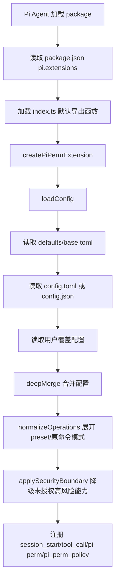
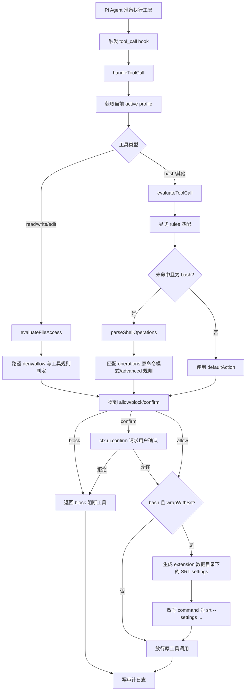
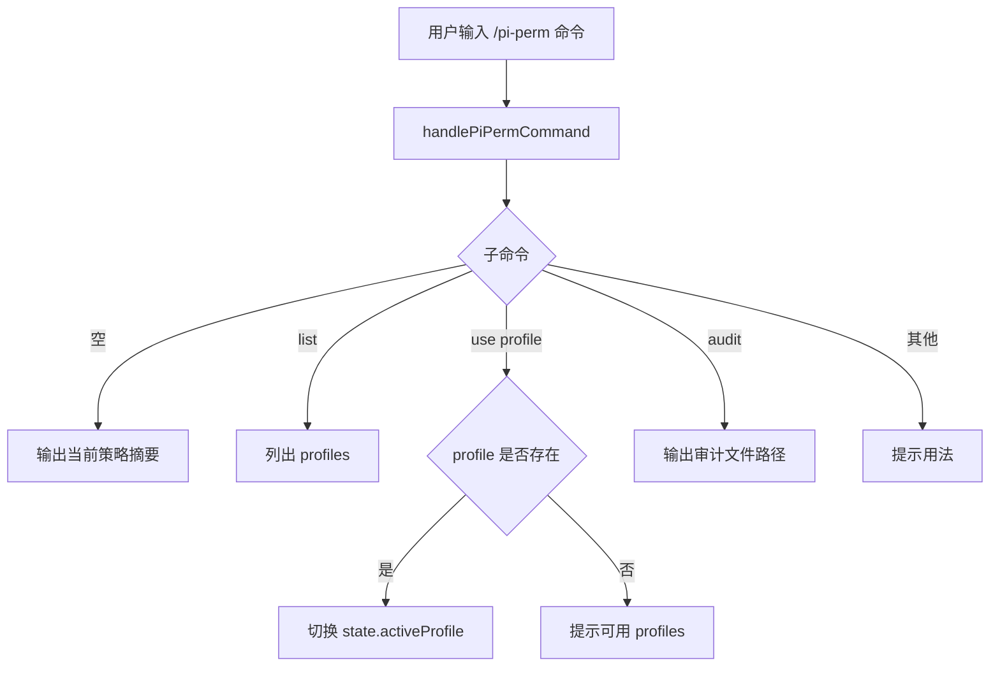

# PiPerm 实现文档

## 1. 概述

pi-perm 是一个 Pi Agent 权限控制 extension package。它通过 Pi extension API 注册生命周期监听、工具调用拦截、命令和只读工具，在 Pi Agent 执行 `bash`、文件读写等工具前，按 TOML/JSON 配置执行确认、阻断、审计和 Sandbox Runtime 包装。

### 1.1 核心职责

| 职责 | 说明 |
|------|------|
| Pi extension 接入 | 在 [index.ts](../index.ts) 默认导出函数中接收 `ExtensionAPI`，注册事件、命令和工具 |
| 配置加载与合并 | 在 [core/config.ts](../core/config.ts) 加载默认配置、项目配置和用户覆盖配置 |
| 操作权限控制 | 在 [core/policy.ts](../core/policy.ts) 与 [core/operations.ts](../core/operations.ts) 中匹配命令操作、文件路径和工具规则 |
| 沙盒包装 | 在 [core/srt.ts](../core/srt.ts) 生成 SRT settings，并把 `bash` 命令包装为 `srt --settings <file> <command>` |
| 用户交互与审计 | 在 [core/extension.ts](../core/extension.ts) 调用 `ctx.ui.confirm/notify` 并通过 [core/audit.ts](../core/audit.ts) 写入审计日志 |

## 2. Pi Extension 工作原理

Pi extension 是一个由 Pi Agent 加载的 TypeScript 模块。模块默认导出一个函数，Pi Agent 会把 `ExtensionAPI` 对象传入该函数。extension 在这个函数里声明自己要参与哪些生命周期、拦截哪些工具调用、暴露哪些命令或工具。

本项目的入口是 [index.ts](../index.ts)：

| 接入点 | 代码位置 | 作用 |
|--------|----------|------|
| 默认导出函数 | [index.ts](../index.ts) | Pi Agent 加载 extension 时执行 |
| `pi.on("session_start")` | [index.ts](../index.ts) | 会话启动时提示当前 active profile |
| `pi.on("tool_call")` | [index.ts](../index.ts) | 每次工具调用前进入权限判定流程 |
| `pi.registerCommand("pi-perm")` | [index.ts](../index.ts) | 注册 `/pi-perm` 命令，用于查看和切换 profile |
| `pi.registerTool("pi_perm_policy")` | [index.ts](../index.ts) | 注册只读工具，让 agent 查询当前权限摘要 |

Pi extension 的关键能力是 `tool_call` hook。Pi Agent 准备执行工具时，会把工具名和入参传给 extension。extension 可以：

- 返回 `{ block: true, reason }` 阻断工具调用。
- 修改 `event.input`，例如把原始 `bash` 命令改写为 SRT 包装命令。
- 调用 `ctx.ui.confirm` 请求用户确认。
- 不返回值，让 Pi Agent 继续执行原工具调用。

## 3. 当前项目如何生效

### 3.1 加载方式

当前仓库根目录就是 Pi package 根目录。[package.json](../package.json) 通过 `pi.extensions` 声明 extension 入口：

```json
{
  "pi": {
    "extensions": ["./index.ts"]
  }
}
```

因此当用户通过 Pi 的 package 加载方式安装或启用该项目后，Pi Agent 会加载 [index.ts](../index.ts)，执行默认导出函数，并注册 `session_start`、`tool_call`、`/pi-perm` 和 `pi_perm_policy`。

### 3.2 配置加载顺序

配置入口在 [core/config.ts](../core/config.ts)。启动时 `createPiPermExtension()` 调用 `loadConfig()`，按以下顺序合并：

| 顺序 | 配置来源 | 说明 |
|------|----------|------|
| 1 | [defaults/base.toml](../defaults/base.toml) | 内置默认 profile、工具策略、推荐操作权限 preset |
| 2 | `config.toml`，兼容 `config.json` | 项目级配置，TOML 优先 |
| 3 | `~/.pi/agent/extensions/pi-perm/config.toml`，兼容 JSON | 用户级覆盖配置；可用 `PI_PERM_USER_CONFIG` 指定路径 |

合并后会执行两类处理：

- `normalizeConfig()`：把 human-friendly 的 `tools.bash.operations` 展开为底层匹配规则。
- `applySecurityBoundary()`：项目配置不能单独开启 Apple Events、弱沙盒、全部 Unix socket、Docker socket 等高风险能力；这些能力必须由用户配置显式授权。

### 3.3 操作权限配置

项目推荐使用 TOML。示例见 [config.example.toml](../config.example.toml)：

```toml
[tools.bash.operations]
preset = "recommended"
block = ["~/.ssh/", "gh auth token", ".git/hooks"]
confirm = ["git push", "rm -r", "curl | sh", "kubectl", "docker"]
allow = ["pnpm install"]
```

这段配置会被 [core/operations.ts](../core/operations.ts) 展开：

- `preset = "recommended"` 启用内置推荐风险操作集。
- `block`、`confirm`、`allow` 直接使用用户熟悉的原命令或命令片段。
- `curl | sh` 这类管道写法会被解析为原始命令文本匹配规则。
- `advanced` 可用于项目自定义命令，例如 `pnpm deploy:prod`。

## 4. 调用链路

### 4.1 启动链路



### 4.2 工具调用权限判定流程



### 4.3 `/pi-perm` 命令流程



## 5. 业务逻辑详解

### 5.1 会话启动

Pi Agent 触发 `session_start` 后，[index.ts](../index.ts) 通过 `ctx.ui.notify` 显示 `pi-perm loaded: <profile>`，帮助用户确认 extension 已加载。

### 5.2 工具拦截

每次工具调用都会进入 [core/extension.ts](../core/extension.ts) 的 `handleToolCall()`。核心判断顺序如下：

1. 根据当前 `state.activeProfile` 读取 profile。
2. 文件类工具走 `evaluateFileAccess()`，先检查路径 deny/allow。
3. 其他工具走 `evaluateToolCall()`。
4. `bash` 会先匹配显式 `rules`，再匹配 `operations`。
5. 结果为 `block` 时直接阻断。
6. 结果为 `confirm` 时先检查当前 session 授权缓存；命中缓存则直接放行并写审计。
7. 未命中缓存时调用 Pi UI 确认，支持“拒绝 / 允许一次 / 本 session 始终允许”。等待用户输入期间会通过 Pi UI 状态 API 显示 blocked 风格状态，并在存在 Herdr Pi integration 时通过 Pi event bus 发出 `herdr:blocked`；旧环境只有 `ctx.ui.confirm` 时，确认成功只按“允许一次”处理。
8. 如果是 `bash` 且 `wrapWithSrt = true`，生成 SRT settings 并改写命令。

### 5.2.1 Session 级授权

[core/extension.ts](../core/extension.ts) 在 extension state 中维护 `sessionAllows` 内存 Map。用户选择“本 session 始终允许”后，系统按当前 active profile、工具名、命中的规则 ID 或操作 ID、目标摘要生成授权 key，并记录最近使用时间。

该授权不会写入 `config.toml`、`config.json` 或用户配置，因此重启 Pi session 后自动失效。每次工具调用前系统会按 `runtime.sessionAllowTtlMs` 清理空闲过期授权；重复命中相同 key 且未过期时，系统跳过确认、刷新最近使用时间并记录 `session_allow_hit` 审计事件。不同 profile、不同命令、不同规则或不同路径仍会重新确认。执行 `/pi-perm use <profile>` 切换 profile 时，系统会清空当前 session 授权缓存。

确认提示由 `core/extension.ts:confirmDecision()` 统一包裹 UI 状态保护。扩展初始化时会从 `index.ts` 注入 `pi.events`。显示选择器前会调用 `events.emit("herdr:blocked", { active: true, label })`、`ctx.ui.setStatus("pi-perm", "blocked: waiting for permission")`、`ctx.ui.setWorkingMessage(...)` 和 `ctx.ui.setWorkingIndicator({ frames: ["■"] })`；无论用户选择、取消还是 UI 抛错，都会在 `finally` 中发送 `active: false` 并恢复默认状态。缺少 event bus 或 Herdr integration 时不影响权限确认。Herdr 的 `done` 是 `idle + pane 未查看` 的 UI 派生状态，pi-perm 不直接发送 done 事件。

### 5.3 命令操作权限

命令操作权限由 [core/operations.ts](../core/operations.ts) 提供 preset 和原命令模式展开，由 [core/policy.ts](../core/policy.ts) 解析和匹配。它不依赖 Sandbox Runtime，因此即使用户关闭 SRT 包装，也仍可对 `rm`、`git push`、`sudo`、`curl | sh`、`kubectl` 等操作做确认或阻断。

常见写法：

| 写法 | 含义 |
|-------|------|
| `rm -r` | 递归删除 |
| `git push` | Git 远程推送 |
| `git reset --hard` | Git 硬重置 |
| `~/.ssh/`、`gh auth token` | 凭据读取 |
| `curl | sh`、`wget | bash` | 远程脚本执行 |
| `scp`、`rsync`、`curl -T` | 网络复制或外传 |
| `pnpm install`、`npm install` | 依赖安装 |
| `docker`、`podman` | 容器运行时操作 |
| `kubectl`、`terraform`、`aws` | 云或集群控制命令 |

### 5.4 SRT 沙盒包装

当 `bash` 策略启用 `wrapWithSrt` 时，[core/extension.ts](../core/extension.ts) 会先解析 pi-perm extension 运行时目录。默认基目录为 `~/.pi/agent/extensions/pi-perm`，`runtime.settingsDir` 只表示该基目录下的相对子目录，默认 `runtime`。绝对 `runtime.settingsDir` 会被配置校验拒绝，避免 SRT settings 回落到项目目录或任意路径。

[core/srt.ts](../core/srt.ts) 会把当前 profile 的 `sandbox` 配置写入 `~/.pi/agent/extensions/pi-perm/runtime/<tool-call-id>.srt-settings.json`，再将原始命令改写为：

```bash
srt --settings ~/.pi/agent/extensions/pi-perm/runtime/<tool-call-id>.srt-settings.json <original command>
```

这样命令操作审批和 OS 级沙盒会串联生效：先确认/阻断高风险操作，再由 Sandbox Runtime 限制实际进程访问文件、网络和 socket。

## 6. 数据模型

### 6.1 配置模型

| 字段 | 说明 |
|------|------|
| `version` | 配置版本，当前为 `1` |
| `activeProfile` | 默认启用的 profile |
| `profiles` | profile 集合，每个 profile 包含 `sandbox` 和可选 `toolDefaults` |
| `tools` | 工具策略，例如 `bash`、`read`、`write`、`edit` |
| `tools.bash.operations` | 命令操作权限，支持 `preset`、`block`、`confirm`、`allow`、`advanced` |
| `prompts` | UI 确认文案和 UI 不可用时的动作 |
| `audit` | 审计开关和日志文件 |
| `runtime` | pi-perm 运行时状态配置，包括 `baseDir`、`settingsDir` 和 `sessionAllowTtlMs` |
| `security` | user-only 高风险能力声明 |

### 6.2 审计记录

审计日志由 [core/audit.ts](../core/audit.ts) 写入 JSON Lines，默认文件为 `audit.jsonl`。主要事件包括：

| 事件 | 说明 |
|------|------|
| `decision` | 工具调用的 allow/block/confirm 判定 |
| `confirm` | 用户确认结果 |
| `profile_switch` | `/pi-perm use <profile>` 切换 |
| `srt_settings` | 生成 SRT settings 文件 |
| `downgrade` | 项目配置请求高风险能力但未获用户配置授权 |

## 7. 影响范围

| 范围 | 影响 |
|------|------|
| Pi 工具调用 | 所有经过 `tool_call` hook 的工具会被策略判定 |
| `bash` 命令 | 可被操作权限确认/阻断，也可被 SRT 包装 |
| 文件工具 | `read`、`write`、`edit` 会按路径策略判定 |
| 用户交互 | `confirm` 规则会弹出确认；UI 不可用时默认按配置阻断 |
| 运行时文件 | SRT settings 写入 `~/.pi/agent/extensions/pi-perm/runtime/`；审计日志默认仍写入 `audit.jsonl` |
| 外部依赖 | 需要 Pi Agent extension API；SRT 包装需要本机存在 `srt` 命令 |

## 8. 验证

当前自动化验证覆盖：

- 配置合并、TOML 优先和原命令模式展开：[test/config.test.ts](../test/config.test.ts)
- 命令操作模式与 preset：[test/operations.test.ts](../test/operations.test.ts)
- 工具规则、文件路径和命令匹配：[test/policy.test.ts](../test/policy.test.ts)
- SRT settings 与命令包装：[test/srt.test.ts](../test/srt.test.ts)
- extension 命令和工具调用处理：[test/extension.test.ts](../test/extension.test.ts)

验证命令：

```bash
pnpm test
pnpm run typecheck
```
